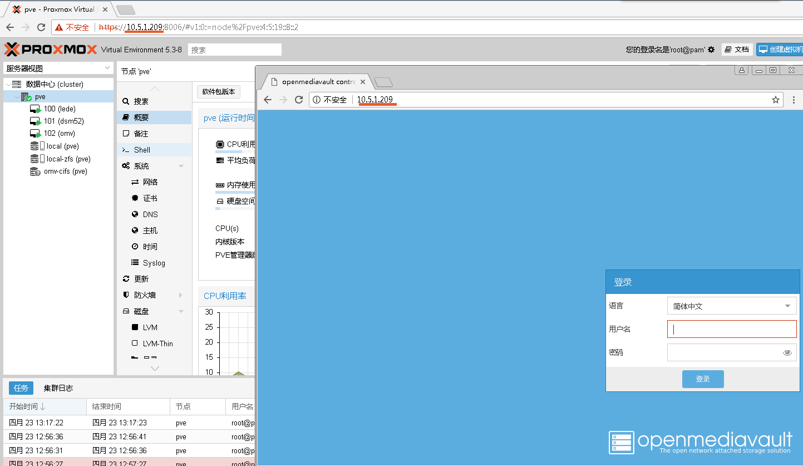

>This is a omv4 install in proxmox ve 5.3/5.4 shell script.

## install guide ##

1. clone or download the code to your proxmox ve. `git clone https://github.com/ivanhao/OmvInPve.git`
2. cd to the path
3. execute the `chmod +x ./*.sh` command to make it have right permission to execute the install or uninstall.
4. `./OmvInPve.sh` to install.
> Don't forget to make a snapshot for rpool before run it.

> you must run this script as `root`.

## uninstall guide ##
`apt-get autoremove openmediavault`
or
rollback your zfs rpool's snapshot and reboot.


***

>这是一个在proxmox ve 5.3/5.4中安装OMV的脚本

## 安装说明 ##
#### 感谢“proxmox研究”群的  灬心海ζ丶 提供的安装方式，我只是在他的基础上整理了一键安装的脚本。我是群里的龙天，如果这个脚本帮到你了，麻烦点一下右上角的star小星星^_^

1. clone或下载安装包到proxmox ve里，例如在/root目录运行：`git clone https://github.com/ivanhao/OmvInPve.git`。
2. 命令行cd到安装包的路径里。
3. 执行`chmod +x ./*.sh`来让程序有执行的权限。
4. `./OmvInPve.sh`来安装，根据提示很快就完成了。然后刷新界面。
> 不要忘记执行前给rpool做个快照，以便恢复快照。

> 需要用root账号来运行

## 卸载 ##

`apt-get autoremove openmediavault` 来卸载。
或者
回滚你的rpool快照，重启。

##  Preview 预览 ##


> 如果用OMV共享pve的rpool，需要设置acl权限：
```
zfs set aclinherit=passthrough rpool
zfs set acltype=posixacl rpool
```
#### 如果这个脚本帮到你了，麻烦点一下右上角的star小星星^_^

## qq交流群: 878510703


## 如果觉得好的请捐赠一下^_^


感谢捐赠人员！

捐赠列表：

*韬祺（来源支付宝）
